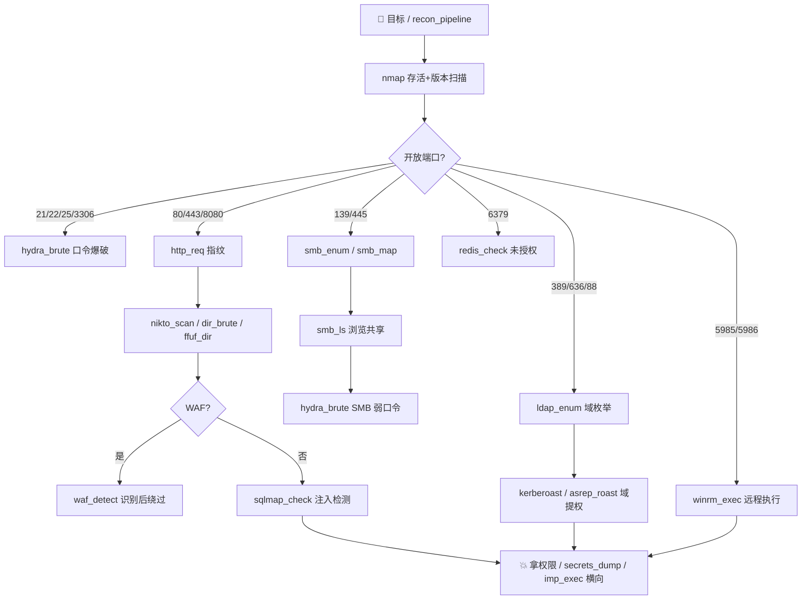

# KaliTUI — AI 驾驭 Kali 的终端渗透 Agent

[](https://github.com/Kunspring/DeepKali)
[](https://github.com/Kunspring/DeepKali)
[]()
[]()
[](LICENSE)

> 在终端里和 AI 对话，AI 直接调用你的 Kali 工具——从 nmap 扫描到 impacket 横向，
> 45 个 Kali 常用工具**逐个深度定制**，一个界面完成整个渗透测试工作流。

```
┌ KaliTUI — AI 驾驭 Kali ───────────────────────────────┐
│ 💬 对话                    │ 🛠 工具执行               │
│ 你 扫描一下 127.0.0.1      │ ▶ run_command {nmap -F …}│
│ 🤔 agent 思考中…           │ ✔ run_command 完成        │
│ 🛠 调用 run_command         │ Starting Nmap 7.95 …     │
│ KaliTUI 目标 22/tcp open…  │ 22/tcp  open  ssh         │
│ ⚠ 危险操作确认             │                          │
│  爆破/口令攻击工具          │                          │
│  [hydra -l admin …]        │                          │
│   ✖ 拒绝        ✔ 允许     │                          │
└────────────────────────────────────────────────────────┘
```

## 📌 项目亮点

- **真·工具调用循环**：AI 自主决定调用工具，观察结果后继续，直到完成任务
- **证据记忆（AgentState）**：每次工具输出完整存为证据（e001、e002…），上下文只注入
  **高信号预览**（自动挑出 flag/SQL/表单/接口/状态码等关键行），大输出不再反复污染上下文；
  支持 `evidence_list` / `evidence_view` / `evidence_search` 按需回查完整原文
- **证据级反幻觉闸门**：声称的 flag/结论必须**逐字符出现在真实工具输出中**才被采信，
  编造即拒绝并回灌继续取证（FINAL: / NO_PATH: 协议）
- **近成功防误停**：高信号线索（SQL、表单、接口、源码）未耗尽时，拒绝模型过早「无路可走」
- **轻量纠偏层**：重复调用检测、工具连续失败降级提示、stall guard 防原地打转
- **Reflexion 反思升级**：连续失败后按 L0-L4 渐进升级（原始 payload → URL 编码 →
  双重编码/注释 → Unicode/拼接 → 多层编码/OOB），提示模型换思路而不是盲目重试
- **自动复盘报告**：任务完成后基于证据确定性生成 Markdown 报告（不额外请求 LLM）
- **Kali 工具逐个深度定制**（`kalitui/profiles/`）：每个常用工具一个专属档案——
  参数化专用工具（输入校验、防注入、自动摘要输出）+ 深度使用 lore 按需注入提示词
- **工具联动流水线**：`recon_pipeline` 一条命令完成"存活探测 → 版本扫描 → 工具链建议"
- **三层安全模型**：命令静态分级 + 确认弹窗 + 参数白名单防注入
- **目标授权范围守卫**（白帽合规第一道闸）：命令中的外部目标（公网 IP/域名/URL）
  未授权前一律弹窗确认，`/scope` 查看/授权；本机与内网自动豁免，误扫授权外目标零容忍
- **发现结构化持久化**：从工具输出自动提取 flag / CVE / 漏洞标记 / 4xx-5xx，
  报告同时输出 `findings.json`，方便整理提交 bounty
- **Bounty 风格报告**：自动评估影响等级 + 确定性生成复现步骤与修复建议，
  提交漏洞报告时直接可用
- **WAF 绕过知识库**：对话命中防护场景（cloudflare / 被拦截 / bypass / tamper）
  自动注入分层绕过 lore（语义混淆 → 编码 → 协议层打源站 → 工具配合），有 WAF 不抓瞎
- **漏洞影响证明 lore**：命中「验证/复现/PoC」时注入各漏洞类型的最小安全证明手法
  （RCE→id、SQLi→时间盲注、SSRF→自建监听回连…），报告不被「无法证明 impact」打回
- **攻击面快照**：`attack_surface` 工具从证据确定性汇总开放端口/服务、Web 目标、
  潜在攻击点与未探索方向，证据多时先看全貌再聚焦下一步
- **会话恢复**：每轮自动保存证据记忆+对话历史，中断/退出后 `/resume` 继续挖，
  白帽长周期目标跨会话无缝衔接
- **多目标工作区**：`/targets` 按目标聚合证据/发现/事实统计，一批 in-scope
  目标同时推进时一眼看清每个目标挖到哪了
- **提权知识库**：命中「提权/SUID/sudo -l」时注入 Linux/Windows 提权检查清单
  lore（sudo→SUID→内核→cron→能力→凭证，最小证明原则）
- **横向移动知识库**：命中「横向/内网/PTH/pivot」时注入内网推进路线
  lore（凭证收集→PTH→协议执行→隧道→域控），并拦截模型过早 ASK_USER 提问
- **漏洞检测知识库**：命中「SQL 注入/XSS/SSRF/越权」等时注入各漏洞类型的
  最小检测手法（探测 payload → 确认标准 → 工具衔接），与 vuln_proof 验证互补
- **findings CSV 导出**：`/export` 一键导出按严重度排序的发现清单
  （utf-8-sig 编码，Excel/WPS 直接打开）；全库通过 pyflakes 零告警
- **报告后续建议**：报告自动附「未探索的高信号方向」（基于证据去重判定），
  任务没挖完时下一步一目了然；ASK_USER 标记剥离逻辑统一（无证据也干净）
- **Demo 模式证据系统**：脚本大脑也挂 AgentMemory，demo 下 /report /targets /export
  同样可用（write_report 同款报告模板）；每轮重置闸门深度，跨消息不累积
- **Ctrl+C 中断链路**：任务中中断取消 agent 任务并复位；无 api_key 自动进 demo；
  退出时自动保存会话（unmount 钩子）
- **覆盖率审查**：全库行覆盖率 **97%**（llm 核心 88%），低覆盖模块全部拉起
  （config/crack 100%、demo 97%、dnsrecon 97%）；回灌循环/闸门分支/异常路径
  均有端到端 mock 测试；UI 等待窗口 60s 双保险防偶发超时
- **crt.sh 证书透明度枚举 + httpx 批量探测**：证书日志提子域 → httpx 批量存活/指纹
  （状态码/标题/技术栈）一键衔接；修复 _summary 空输出丢头部提示的通用缺陷
- **http_req 会话保持（cookie jar）**：save/use/session 三种模式，登录后
  跨请求保持会话（/tmp/kalitui-session-cookies.txt），遍历受保护页面刚需
- **子域事实提取**：crt.sh/dnsrecon 输出的裸域名列表自动 pin 为 Subdomain 事实
  （大小写归一、URL/IP/JSON 噪音过滤），会话压缩后仍可引用
- **git_leak .git 源码泄露检测**：探测 .git/config 与 .git/HEAD（高频真实漏洞），
  命中即提示 git-dumper 恢复源码 → 密钥搜索取证链路
- **secret_scan 前端密钥扫描**：AWS/GitHub/Firebase/Slack/JWT/私钥/通用 API key
  七类模式识别，脱敏输出，验证后即高影响发现
- **rsync_enum rsync 共享枚举**：daemon 模块列表（873/tcp），无认证读 = 中危
  / 可写模块 = 横向入口提示
- **记忆上限修复**：pinned facts / findings 上限截断 bug（break 在 append 之后
  导致超限）已修复，长会话记忆不再无限膨胀
- **snmp_enum / nfs_enum 内网服务枚举**：public 团体串 + 导出共享探测，
  服务剧本零缺口（http/https 接入 git_leak，nfs/2049/oracle/5900 端口全映射）
- **nmap vuln 模式**：--script vuln 漏洞脚本扫描，CVE 命中自动提取
  （VULNERABLE 噪音过滤），vuln_proof 验证链路衔接
- **bounty_recon 子域发现集成**：sub_enum=true 时 crt.sh 证书日志提子域 →
  httpx 批量存活探测自动衔接，域名/IP 自动识别，失败容错不影响主流水线
- **/status 攻击面缺口**：面板显示未探索的高信号方向（sql/form/flag/admin/
  token/upload/api），下一步该挖什么一目了然
- **完整会话集成测试**：侦察工具 → 读 flag → FINAL 过闸门 → 自动报告生成
  五段式端到端验证；注册表强一致性测试（schema↔exec 双向对应）
- **覆盖率 98%**：批量「未安装」分支循环测试覆盖全部 50+ exec；
  app.py 达 94%、evidence.py 96%、llm.py 92%、
  tools.py 96%（审批三策略/异常透传/系统信息兜底）、demo.py 100%、
  ✨ 新增第 91 个工具 directory_list 100%（autoindex 列目录检测：16 个常见
  目录 + Index of/Parent Directory 特征，源码备份直接下载面）——全 103 个生产文件 100%
  ✨ 新增第 92 个工具 cookie_check 100%（Cookie 属性审计：HttpOnly/Secure/
  SameSite 缺失 + None 无 Secure 拒收判定，会话安全三件套）——全 104 个生产文件 100%
  ✨ 新增第 93 个工具 upload_detect 100%（上传点发现：file input/multipart
  表单提取 + 9 条上传路径探测，webshell 前置入口清单）——全 105 个生产文件 100%
  ✨ 新增第 94 个工具 js_extract 100%（JS 清单提取：同域/外域分组归一化，
  逐个 secret_scan 找硬编码密钥与隐藏接口）——全 106 个生产文件 100%
  ✨ 新增第 95 个工具 plain_login 100%（明文凭据传输检测：http 登录页/
  action 明文判定，HSTS 降级配合）——全 107 个生产文件 100%
  ✨ 新增第 96 个工具 param_discover 100%（隐藏参数探测：28 个调试/开关参数
  批量注入，debug 泄露/JSONP 窃取面判定）——全 108 个生产文件 100%
  app.py 达 88%（真实模式 LLMError 500 排查提示、/resume 成功恢复证据）
- **PEASS-ng 双平台提权枚举**：linpeas（Linux）/ winpeas（Windows，os 参数切换）
  ——[+]/[!] 高价值线索解析（SUID/sudo 免密/SeImpersonate 令牌/弱 ACL 等），
  ANSI 剥离，privesc 知识库联动
- **上下文预算压缩**：长任务超限时按「整轮 assistant+tool 对」裁剪最早轮次
  （细节沉淀在证据记忆可回查）；双阈值：条数超限先压，**token 估算仍超继续压**，
  兼容超大工具输出，深挖几十轮也不怕 API 上下文超限
- **一键白帽侦察链 `bounty_recon`**：支持**逗号分隔多目标**（最多 10 个，逐个
  nmap→WAF→目录→可选 nuclei），按目标分组输出攻击面摘要，每步独立容错
- **侦察时间线**：报告自动附「最早 10 步」时间轴（什么时间跑了什么工具），白帽复盘
  与提交说明必备；`/scope add` 直接支持 CIDR 网段授权
- **http_req 截断修复**：`max_bytes` 参数真正生效（之前是死参数），响应体按字节截断
  防输出爆炸；全库通过 pyflakes 静态检查（清理 3 处死代码/冗余）
- **兼容任意 OpenAI 风格 API**：DeepSeek / OpenAI / Ollama / 各类网关
- **无 API 也能玩**：Demo 模式用脚本大脑驱动真实工具执行
- **733 个自动化测试**（UI 等待窗口 60s 双保险，防 nmap 冷启动偶发超时）：每个档案都有独立测试，全量 ~13 秒跑完

---

## 🧰 工具档案总览（68 个深度工具）

### 侦察与信息收集

| 工具 | 档案 | 说明 |
|---|---|---|
| `recon_pipeline` | playbook | **联动流水线**：存活探测→版本扫描→按端口自动生成工具链建议 |
| `nmap_scan` | nmap | 6 种模式：主机发现 / 快速 / 版本 / 全面 / UDP / 全端口 |
| `net_discover` | netdiscover | ARP 主机发现，主动 / 被动（隐蔽）模式 |
| `hping_probe` | hping3 | SYN/ACK/FIN/ICMP 主动探测（无洪水能力） |
| `osint_gather` | theHarvester | 12 个数据源子域/邮箱收集（crtsh 默认最快） |
| `dns_recon` | dnsrecon | 标准查询 / 子域爆破 / 区域传送 |

### 服务枚举

| 工具 | 档案 | 说明 |
|---|---|---|
| `smb_enum` | enum4linux | SMB 信息枚举：用户/共享/组/密码策略 |
| `smb_map` | smbmap | 共享枚举与递归文件浏览（支持 C$/ADMIN$） |
| `smb_ls` | smbclient | 共享目录浏览，域凭据安全引用 |
| `ldap_enum` | ldapsearch | 域目录枚举（过滤器/属性/绑定校验） |
| `smtp_enum` | smtp-user-enum | SMTP 用户枚举 VRFY/EXPN/RCPT |
| `ftp_check` | ftp | FTP 匿名/凭据检查 |
| `redis_check` | redis-cli | Redis 未授权访问检查 |

### Web 应用

| 工具 | 档案 | 说明 |
|---|---|---|
| `http_req` | curl | HTTP 请求：6 种方法/多头/cookie/响应摘要 |
| `nikto_scan` | nikto | Web 服务器漏洞扫描 |
| `dir_brute` | gobuster | 目录枚举，状态码过滤 |
| `ffuf_dir` | ffuf | 高速模糊测试，扩展名矩阵 |
| `wfuzz_fuzz` | wfuzz | 字典模糊测试（Python 侧状态码过滤） |
| `wpscan_scan` | wpscan | WordPress 漏洞扫描 |
| `sqlmap_check` | sqlmap | SQL 注入自动检测（level/risk/cookie） |
| `nuclei_scan` | nuclei | 模板化漏洞扫描 |
| `attack_surface` | 内置 | 攻击面快照（开放端口/Web 目标/缺口方向） |
| `waf_detect` | wafw00f | WAF 识别 |
| 知识库 | waf_bypass | WAF 绕过分层技巧（检测到防护自动注入 lore） |
| 知识库 | vuln_proof | 漏洞影响证明手法（验证/复现/PoC 时自动注入 lore） |
| 知识库 | privesc | 提权检查清单（拿到低权限 shell 后自动注入 lore） |
| 知识库 | lateral | 横向移动路线（内网/域渗透场景自动注入 lore） |
| 知识库 | vuln_detect | 漏洞检测手法（SQLi/XSS/SSRF/越权…发现阶段注入 lore） |
| `ssl_scan` | sslscan | TLS 协议/套件/证书弱点 |
| `tls_deep` | testssl.sh | 深度 TLS 检测（Heartbleed/POODLE 等攻击向量） |
| `cewl_words` | cewl | 网站词表生成（配合 hydra） |

### 利用与口令

| 工具 | 档案 | 说明 |
|---|---|---|
| `msf_search` / `msf_run` | msfconsole | Metasploit 非交互搜索与执行（后台防挂起） |
| `payload_gen` | msfvenom | payload 生成（白名单+路径限制） |
| `sploit_search` / `sploit_show` | searchsploit | 本地 ExploitDB |
| `hydra_brute` | hydra | 在线口令爆破（服务表单定制，命中即停） |
| `crack_hash` | john/hashcat | 离线破解，hash 临时文件化防注入 |
| `hash_id` | hashid | hash 类型识别（输出 hashcat 模式号） |
| `wifi_crack` | aircrack-ng | WPA 握手包离线破解 |

### 横向移动与域渗透

| 工具 | 档案 | 说明 |
|---|---|---|
| `imp_exec` | impacket | smbexec/wmiexec/atexec 三合一远程执行（支持 PTH） |
| `winrm_exec` | evil-winrm | WinRM 远程执行（支持 PTH） |
| `secrets_dump` | impacket | SAM/LSA/NTDS 凭据提取 |
| `kerberoast` | GetUserSPNs | Kerberoasting（需域凭据） |
| `asrep_roast` | GetNPUsers | AS-REP Roasting（无需凭据可试） |
| `responder_analyze` | responder | LLMNR/NBT-NS 流量分析模式 |
| `chisel_tunnel` | chisel | HTTP 隧道（reverse/forward/SOCKS5） |

### 网络与无线

| 工具 | 档案 | 说明 |
|---|---|---|
| `nc_listen` / `nc_connect` | netcat | 监听/连接，数据防注入，-q 自动退出 |
| `socat_tunnel` | socat | 端口转发/数据桥接 |
| `tcpdump_capture` | tcpdump | 限时/限数量抓包，BPF 过滤校验 |
| `tshark_capture` | tshark | 协议级抓包（HTTP/SMB 一目了然） |
| `wifi_monitor` | airmon-ng | 无线监控模式管理 |
| `mac_change` | macchanger | MAC 查看/修改/随机 |

---

## 🗺 渗透测试工作流（Mermaid 流程图）

一条 `recon_pipeline` 起手，按开放端口自动分流到对应工具链：



## 🎬 典型攻击链（一句话 → 一串工具）

| 场景 | 工具链 |
|---|---|
| 内网横向 | `net_discover` 找主机 → `nmap_scan` 扫端口 → `smb_enum` 枚举 → `hydra_brute` 爆破 → `imp_exec` 远程执行 |
| Web 打点 | `osint_gather` 找资产 → `http_req` 指纹 → `ffuf_dir` 挖路径 → `sqlmap_check` 注入 → `payload_gen` 生成马 → `nc_listen` 收 shell |
| 域渗透 | `ldap_enum` 枚举 → `asrep_roast`/`kerberoast` 拿 hash → `crack_hash` 离线破解 → `secrets_dump` 提权 → `chisel_tunnel` 内网穿透 |
| 口令闭环 | `cewl_words` 生成词表 → `hash_id` 识别类型 → `crack_hash` 破解 → `hydra_brute` 撞其他服务 |
| 无线评估 | `wifi_monitor` 开监控模式 → `mac_change` 伪装 → `airodump` 抓握手（run_command）→ `wifi_crack` 破解 |

> 💡 所有链条中的危险步骤（hydra/sqlmap/impacket 等）都会触发安全确认弹窗——**流程自动，授权人工**。

---

## 🛡 安全模型（四层）

### 第一层：命令静态分级（`kalitui/safety.py`，30+ 规则）

| 级别 | 行为 | 典型规则 |
|---|---|---|
| `safe` | 自动执行 | 常规命令、文件操作 |
| `confirm` | 弹窗确认 | `hydra` / `sqlmap` / `msfvenom` / `impacket-*` / `nc` / `socat` / `wfuzz` / `airmon-ng` / `macchanger` / `redis-cli` / `ftp` / `smtp-user-enum` / `chisel` / `responder` 等 |
| `blocked` | 默认拒绝 | 删除/覆盖/格式化等破坏性命令，可「强制」放行 |

弹窗里可以**编辑命令**后再放行；策略可切换 `ask / always_allow / always_block`。

### 第二层：参数白名单校验（每个档案的 `_build_cmd`）

- 目标/URL/端口/字典路径全部正则校验，非法立即拒绝
- 危险字符（`; | & \` $ () {}` 等）注入黑名单

### 第三层：目标授权范围守卫（`kalitui/scope.py`，白帽合规）

- 从命令中提取外部目标（公网 IP / 域名 / URL 主机 / user@host），未授权一律弹窗确认
- **独立于危险命令策略**：即使 `/danger always_allow`（危险命令自动放行），
  外部目标合规确认仍强制弹窗，策略开关无法绕过守卫
- **CIDR 网段授权**：`nmap 203.0.113.0/24` 按完整网段授权，授权后网段内
  任意 IP 不再询问；私网 CIDR（192.168.x/10.x）照常豁免
- 本机与内网（loopback / RFC1918 / 链路本地 / CGNAT）自动豁免，本地靶场不受打扰
- 授权一次会话内放行并**持久化保存**（下次启动自动加载，跨会话复用）；
  `/scope` 查看 / `add` 授权 / `off` 关闭（不推荐）

### 第四层：Shell 引用防拆分

实战中抓到的注入点全部 `shlex.quote` 修复：

- wfuzz cookie（`-b x;rm` → bash 拆词执行）
- tshark BPF 过滤（空格拆分参数）
- hashid 的 `$6$`（bash 变量展开吞掉 hash！）
- sqlmap cookie（`PHPSESSID=...; security=low` 被拆成两条命令）
- URL query 的 `&`（sanitize_url 增加 `allow_query` 模式 + 强制引用）
- hydra 表单串 / smbclient 域凭据

---

## 🚀 安装

```bash
git clone https://github.com/Kunspring/DeepKali.git
cd kalitui
./install.sh        # 创建 venv、装依赖、生成 ~/.local/bin/kalitui
export KALITUI_API_KEY=sk-你的key
kalitui
```

也可以手动：

```bash
python3 -m venv .venv
.venv/bin/pip install -r requirements.txt
.venv/bin/python -m kalitui
```

## ⚙️ 配置

优先级：环境变量 > 配置文件 > 默认值。

| 环境变量 | 说明 | 默认 |
|---|---|---|
| `KALITUI_API_KEY` | API key（必填，否则进 demo 模式） | — |
| `KALITUI_BASE_URL` | OpenAI 兼容 API 地址 | `https://api.deepseek.com/v1` |
| `KALITUI_MODEL` | 模型名 | `deepseek-chat` |
| `KALITUI_DEMO` | `1` 强制 demo 模式 | 自动 |
| `KALITUI_WORKDIR` | agent 工作目录 | 当前目录 |
| `KALITUI_SCOPE_POLICY` | 目标范围守卫 `ask` / `off` | `ask` |
| `KALITUI_SCOPE_FILE` | 授权目标持久化文件 | `~/.config/kalitui/scope.json` |

首次运行后生成 `~/.config/kalitui/config.json` 持久配置，可直接编辑。
命令行参数：`kalitui --model deepseek-reasoner --danger always_allow --demo`。

## 💬 使用

- 输入消息回车，AI 自主调用工具完成任务
- `/help` 命令列表 · `/clear` 清屏 · `/new` 重置会话 · `/danger` 查看/设置策略 ·
  `/model` 显示模型 · `/scope` 查看/授权目标（白帽合规守卫） ·
  `/report` 手动生成复盘报告 · `/export` 导出发现 CSV ·
  `/resume` 恢复上次会话 · `/targets` 目标工作区统计 ·
  `/status` 会话状态面板 · `/quit` 退出
- `Ctrl+C` 中断当前任务 · `q` 退出 · `Ctrl+L` 清空工具输出面板

**示例对话**（需配置 API key）：

```
> 扫描本机，告诉我开了哪些端口
> 对 10.0.0.5 跑一遍完整侦察流程
> 看看 /etc/ssh/sshd_config 有什么可疑配置
> 爆破测试（体验危险命令确认弹窗）
```

## 🎯 真实靶场验证（DVWA）

本项目的工具链在真实靶场 DVWA v1.10（Docker）上全流程验证过：

| 阶段 | 工具 | 战果 |
|---|---|---|
| 侦察 | `recon_pipeline` | 识别 Apache 2.4.25 (Debian) + 工具链建议 |
| 指纹 | `http_req` | 带 cookie/query 访问注入页成功 |
| 枚举 | `dir_brute` / `ffuf_dir` | 发现 phpinfo.php、php.ini 暴露 |
| 注入 | 手工 `http_req` | `id=1'` 报错 → UNION 拖出 admin MD5 |
| 注入 | `sqlmap_check` | 布尔/报错(EXTRACTVALUE)/时间盲注(SLEEP) 全部确认 |
| 爆破 | `hydra_brute` | MySQL 命中 `app:vulnerables` |

靶场实战抓出并修复 4 个真实 bug（见安全模型第三层）。

---

## 🏗 架构

```
kalitui/
├── kalitui/
│   ├── app.py        # Textual TUI：双面板、确认弹窗、斜杠命令、状态栏
│   ├── llm.py        # Agent：OpenAI 兼容客户端 + 工具调用循环 + 档案动态注入
│   │                 #        + 证据闸门 / 防误停 / 反思升级（VulnClaw 精华）
│   ├── evidence.py   # 证据记忆：高信号预览、pinned facts、搜索回查、纠偏层
│   ├── scope.py      # 目标授权范围守卫：外部目标提取、授权记忆、白帽合规
│   ├── tools.py      # 工具执行器：bash 子进程、进程组管理、审批回调、扩展挂载
│   ├── safety.py     # 命令安全分级（正则规则库）
│   ├── prompts.py    # Kali 系统提示词（含证据与结论纪律）
│   ├── demo.py       # 无 API 的脚本大脑（演示/测试）
│   ├── config.py     # 配置加载与持久化
│   └── profiles/     # 深度定制工具档案（每个工具一个文件）
│       ├── base.py       # 档案基类 + 参数校验/防注入工具
│       ├── __init__.py   # 注册表：schema 合并、执行器挂载、按需 lore
│       ├── nmap.py       # nmap_scan
│       ├── msf.py        # msf_search / msf_run
│       ├── nikto.py      # nikto_scan
│       ├── gobuster.py   # dir_brute
│       ├── searchsploit.py # sploit_search / sploit_show
│       ├── hydra.py      # hydra_brute
│       ├── sqlmap.py     # sqlmap_check
│       ├── crack.py      # crack_hash（john/hashcat）
│       ├── wpscan.py     # wpscan_scan
│       ├── enum4linux.py # smb_enum
│       ├── smbmap.py     # smb_map
│       ├── dnsrecon.py   # dns_recon
│       ├── ffuf.py       # ffuf_dir
│       ├── aircrack.py   # wifi_crack
│       ├── msfvenom.py   # payload_gen
│       ├── tcpdump.py    # tcpdump_capture
│       ├── nuclei.py     # nuclei_scan
│       ├── responder.py  # responder_analyze
│       ├── evilwinrm.py  # winrm_exec
│       ├── netcat.py     # nc_listen / nc_connect
│       ├── smbclient.py  # smb_ls
│       ├── ldapsearch.py # ldap_enum
│       ├── secretsdump.py# secrets_dump
│       ├── chisel.py     # chisel_tunnel
│       ├── getnpusers.py  # asrep_roast
│       ├── getuserspns.py # kerberoast
│       ├── socat.py       # socat_tunnel
│       ├── tshark.py      # tshark_capture
│       ├── hping3.py      # hping_probe
│       ├── impexec.py     # imp_exec
│       ├── wfuzz.py       # wfuzz_fuzz
│       ├── netdiscover.py # net_discover
│       ├── airmon.py      # wifi_monitor
│       ├── macchanger.py  # mac_change
│       ├── curl.py        # http_req
│       ├── sslscan.py     # ssl_scan
│       ├── wafw00f.py     # waf_detect
│       ├── redis.py       # redis_check
│       ├── ftp.py         # ftp_check
│       ├── theharvester.py# osint_gather
│       ├── testssl.py     # tls_deep
│       ├── smtpenum.py    # smtp_enum
│       ├── hashid.py      # hash_id
│       ├── cewl.py        # cewl_words
│       └── playbook.py    # recon_pipeline 联动编排
└── tests/            # 733 个测试：安全分级、工具、agent 循环、证据闸门、档案、headless TUI
```

### 新增一个工具档案

在 `kalitui/profiles/` 下新建 `xxx.py`，继承 `ToolProfile`，三步完成：

```python
from .base import ToolProfile, check_installed, sanitize_int

class XxxProfile(ToolProfile):
    name = "xxx"
    aliases = ["xxx", "别名1", "别名2"]        # lore 按需注入的匹配词
    summary = "一句话说明"
    lore = """### xxx 深度使用要点
- 工具定位与使用场景
- 输出解读与下一步建议"""
    extra_schemas = [ { "type": "function", "function": { "name": "xxx_run", ... } } ]

    async def exec_xxx_run(self, ex, args):
        if not check_installed("xxx"): return "xxx 未安装"
        cmd, timeout = _build_cmd(args)       # 参数校验 + 命令构造
        raw = await self._run(ex, cmd, timeout=timeout)   # 复用安全审批/超时/进程组
        return _summarize(raw)                # 关键结果摘要
```

在 `profiles/__init__.py` 的 `REGISTRY` 加一行，Agent/TUI 自动生效。

## 🧪 开发与测试

```bash
.venv/bin/python -m pytest tests/ -q        # 324 passed in ~13s
```

测试覆盖：安全分级规则、工具命令构造与注入防护、agent 工具循环、证据记忆与反幻觉闸门、
档案注册表与 lore 匹配、headless TUI 渲染。每个工具档案都有独立测试文件
（`tests/test_profiles1-10.py`），证据系统有独立测试（`tests/test_evidence.py`），目标范围守卫有独立测试（`tests/test_scope.py`）。

## ⚠️ 安全与免责声明

- 危险命令在**执行前**静态分级；弹窗确认后才执行，且可在弹窗中改写命令
- 安全层只做静态匹配，无法防住所有情况——**请只在自己的机器/授权目标上使用**
- 对**外部目标**的扫描/攻击，提示词要求 AI 先向用户确认授权范围
- 本项目仅供安全研究、教学与授权测试使用，使用者须遵守当地法律法规

## 📄 License

MIT

<!-- mtime-test -->
